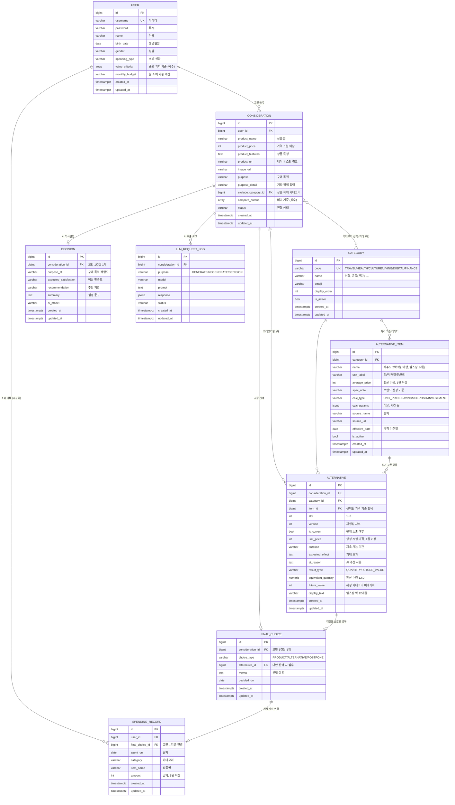

# CHOEZY ERD 설명 문서

> DB: PostgreSQL (PR #2 `feat: PostgreSQL 연동` 기준)

---

## 1. 개요

이 프로젝트는 **"살까 말까 고민하는 상품의 기회비용을 보여주는 서비스"** 이며,
데이터 구조는 **구매 고민 하나를 중심으로** 설계되어 있습니다.

핵심 개념은 다음과 같습니다:

- 하나의 구매 고민 = **Consideration**
- 그 고민에서 생성된 대안들 = **Alternative**
- 대안의 가격 기준 데이터 = **AlternativeItem**

가장 중요한 점 하나:

> **대안의 가격은 AI가 만들지 않고, 우리가 DB에 미리 넣어둔 값을 씁니다.**
> AI는 "어떤 대안을 추천할지"만 고르고, 가격·출처는 `AlternativeItem`에서 가져옵니다.
> 가격까지 AI가 만들면 같은 "일본 여행"이 호출할 때마다 금액이 달라져 기회비용 숫자를 믿을 수 없게 됩니다.

또한 가격 기준 데이터가 변경될 때는 기존 `AlternativeItem`을 직접 수정하지 않고
**새로운 행을 추가하는 방식으로 가격 이력을 보존합니다.**

---

## 2. 핵심 구조 (전체 그림)

```text
User
└── Consideration (구매 고민 = 상품 + 목적 + 선택 카테고리)
    ├── Alternative (카테고리당 3개 · 기회비용 포함)
    ├── Decision (AI 구매 의사결정)
    └── FinalChoice (최종 선택 결과)

Category (대안 카테고리 6개)
└── AlternativeItem (대안 가격 기준 데이터 · 최대한 많이)
    └── Alternative가 참조해서 가격·출처·기준일을 가져옴
```

핵심은 **Consideration → Alternative → AlternativeItem** 구조입니다.

---

## 3. ER 다이어그램



---

## 4. 화면별 데이터 흐름

### 4.1 회원가입

**필요한 데이터**
- 아이디 / 이름 / 생년월일 / 성별 / 비밀번호
- 소비 성향, 중요 가치 기준, 월 소비 가능 예산

**사용하는 테이블**
- `User`

### 4.2 메인페이지 (구매 고민 입력)

**필요한 데이터**
- 구매 고민 중인 상품 (네이버 쇼핑 검색 또는 직접 입력)
- 구매 목적
- 카테고리 선택 (최대 3개)

**사용하는 테이블**
- `Consideration`
- `Category`

### 4.3 대안 생성 페이지

**필요한 데이터**
- 카테고리별 대안 3개
- 대안별 가격·소요 기간
- 개별 재생성 버튼

**사용하는 테이블**
- `AlternativeItem` (AI에게 넘길 후보 목록 + 가격 조회)
- `Alternative` (생성 결과 저장)
- `LLMRequestLog`

### 4.4 비교표 & 기회비용 시각화 페이지

**필요한 데이터**
- 카테고리별 탭
- 선택한 비교 기준에 맞춘 비교표
- 기회비용 환산 결과 (`220만원 = 헬스장 12개월`)

**사용하는 테이블**
- `Alternative`
- `AlternativeItem` (생성 당시 사용한 출처·기준일 표시)
- `Consideration` (선택된 비교 기준)

### 4.5 AI 구매 의사결정 페이지

**필요한 데이터**
- 구매 목적 적합도 / 예상 만족도 / 추천 의견
- 설명 문구

**사용하는 테이블**
- `Decision`

### 4.6 최종 선택 결과 입력 페이지

**필요한 데이터**
- 상품 구매 / 대안 선택 / 보류 중 선택
- 선택 이유

**사용하는 테이블**
- `FinalChoice`
대안을 선택한 경우에만 `alternative_id`를 저장합니다.

### 4.7 소비 기록 (후순위)

**필요한 데이터**
- 날짜 / 카테고리 / 상품명 / 금액
- 월별·카테고리별 소비 차트

**사용하는 테이블**
- `SpendingRecord`

---

## 5. 테이블 설명

### 5.1 User — 소비 프로필

회원가입에서 입력받은 값이 그대로 AI 프롬프트에 들어갑니다.

| 필드 | 설명 |
|---|---|
| `username` | 아이디 (로그인) |
| `name` | 이름 |
| `birth_date` | 생년월일 |
| `gender` | 성별 |
| `spending_type` | 소비 성향 — 경험/만족, 가성비, 성장/자기개발, 자산 형성 |
| `value_criteria` | 중요 가치 기준 (복수) — 가격, 만족도, 품질, 활용도, 장기 가치 |
| `monthly_budget` | 월 소비 가능 예산 — 10만원 이하 ~ 200만원 이상 6구간 |

> 예산을 구간으로 저장하는 이유: 회원가입 UI가 6개 라디오 버튼이고, 비교표의 "가용 예산" 열에서도 이 값을 그대로 씁니다.

### 5.2 Consideration — 구매 고민

**모든 분석의 중심 단위입니다.**

| 필드 | 설명 |
|---|---|
| `user_id` | 누구의 고민인지 |
| `product_name` / `product_price` / `product_features` | 고민 중인 상품 정보 |
| `product_url` / `image_url` | 네이버 쇼핑 API 결과 |
| `purpose` | 구매 목적 — 개발/업무, 디자인/창작, 공부, 취미, 여행 기록, 기타 |
| `purpose_detail` | 기타 선택 시 직접 입력 |
| `exclude_category_id` | 고민 상품이 속한 카테고리. **대안 후보에서 제외**하는 데 씀 |
| `compare_criteria` | 비교 기준 (복수) — 가격, 지속 가능 기간, 기대 효과, 가용 예산 |
| `status` | `DRAFT` → `GENERATED` → `DECIDED` → `CLOSED` |
| (M2M) | 선택한 `Category` 최대 3개 |

`product_price`는 기회비용 계산의 기준 금액이므로 **1원 이상만 저장할 수 있도록 DB 제약을 둡니다.**

> **`exclude_category_id`가 필요한 이유**: "디지털 전자기기" 카테고리 때문입니다. 맥북을 고민하는데 대안으로 "노트북 구매"가 뜨면 의미가 없습니다.

> **상품 정보를 별도 `Product` 테이블로 빼지 않은 이유**: 가격은 조회 시점 스냅샷이어야 하고(나중에 실제 가격이 바뀌어도 계산된 기회비용이 흔들리면 안 됨), 상품 자체를 재사용할 일이 MVP에는 없습니다. 나중에 "이 상품을 고민한 사람들" 같은 기능이 생기면 그때 분리해도 마이그레이션이 간단합니다.

### 5.3 Category — 대안 카테고리 (마스터, 6개)

| code | name |
|---|---|
| `TRAVEL` | 여행 |
| `HEALTH` | 운동(건강) |
| `CULTURE` | 문화(여가) |
| `LIVING` | 생활편의 |
| `DIGITAL` | 디지털 전자기기 |
| `FINANCE` | 재정 |

`is_active`로 노출을 끌 수 있습니다. **재정 카테고리는 MVP에 포함하기로 결정했으므로 6개 모두 `is_active=True`로 시작합니다.** (§7)

카테고리 6건은 구조적으로 고정된 마스터 데이터이므로 **data migration의 `RunPython`으로 생성합니다.**

### 5.4 AlternativeItem — 대안 가격 기준 데이터

| 필드 | 설명 |
|---|---|
| `category_id` | 어떤 카테고리의 항목인지 |
| `name` | `제주도 2박 3일 여행`, `PT 1회`, `서울역-부산역 KTX 왕복` |
| `unit_label` | `회` `박` `개월` `잔` `마리` — 기회비용 문구를 조립할 때 씀 |
| `average_price` | 평균 비용 (원). **재정 항목은 계산에 쓰지 않음** (§7) |
| `spec_note` | `엽떡 기본맛 기준`, `브랜드 명시`처럼 가격 산정 기준 |
| `calc_type` | 계산 방식 (§7) |
| `calc_params` | 재정 항목의 기간·수익률 (§7). 소비형은 비워 둠 |
| `source_name` / `source_url` | **출처** |
| `effective_date` | **가격 기준일** |
| `is_active` | 현재 AI 후보로 사용할 수 있는 데이터인지 |

`average_price`는 계산에 사용되는 기준 금액이므로 **1원 이상만 저장할 수 있도록 DB 제약을 둡니다.**

> **출처와 기준일을 필수로 둔 이유**: "평균 비용"은 시간이 지나면 반드시 틀려집니다. 화면에 *"2026.07 기준 · 출처 OO"* 를 같이 보여줘야 숫자가 신뢰를 얻고, 나중에 값이 틀렸다는 지적을 받아도 방어됩니다.

#### 가격 변경 규칙

`AlternativeItem`의 가격·출처·기준일이 변경될 때 기존 행을 직접 수정하지 않습니다.

기존 AlternativeItem
→ is_active = False

새로운 AlternativeItem
→ 새로운 가격
→ 새로운 출처
→ 새로운 기준일
→ is_active = True

예시:

기존 행
헬스장 1개월 / 180,000원 / 2026-07-01 / is_active=False

새 행
헬스장 1개월 / 200,000원 / 2026-10-01 / is_active=True

이 방식을 사용하는 이유는 과거 `Alternative`가 생성될 때 사용한 **가격·출처·기준일을 함께 보존하기 위해서입니다.**

기존 행의 가격만 수정하면 다음과 같은 불일치가 생길 수 있습니다.

Alternative.unit_price = 180,000원
AlternativeItem.effective_date = 2026-10-01
AlternativeItem.average_price = 200,000원

따라서 `AlternativeItem`은 가격 변경 시 **UPDATE가 아니라 INSERT 방식으로 버전을 관리합니다.**

### 5.5 Alternative — 생성된 대안

AI가 `AlternativeItem` 중에서 고른 결과 + 기회비용 계산 결과입니다.

| 필드 | 설명 |
|---|---|
| `consideration_id` | 어떤 고민에서 나온 대안인지 |
| `category_id` | 어떤 카테고리 탭에 속하는지 |
| `item_id` | AI가 고른 가격 기준 항목 |
| `slot` | 1 / 2 / 3 — 카테고리 안에서의 자리 |
| `version` | 재생성 차수 (최초 1, 재생성할 때마다 +1) |
| `is_current` | 현재 화면에 보이는 행만 `True` |
| `unit_price` | 계산에 사용한 기준 금액 스냅샷 — 소비형은 `item.average_price`, **재정형은 `product_price`(원금)** |
| `duration` | 지속 가능 기간 (비교표 열). 소비형은 AI, **재정형은 서버가 `period_month`로 채움** |
| `expected_effect` | 기대 효과 (비교표 열). 소비형은 AI, **재정형은 서버가 계산 결과로 채움** |
| `ai_reason` | 왜 이걸 골랐는지 |
| `result_type` | `QUANTITY` 또는 `FUTURE_VALUE` |
| `equivalent_quantity` | 소비형 기회비용 환산 수량 |
| `future_value` | 재정형 대안의 미래가치 |
| `display_text` | `헬스장 약 12개월`과 같은 화면 표시 문구 |

다음 UNIQUE 제약을 둡니다.

```text
(consideration_id, category_id, slot, version)
```

또한 각 슬롯에는 현재 노출되는 대안이 하나만 존재해야 합니다.

```text
(consideration_id, category_id, slot)
WHERE is_current = True
```

`slot`은 1부터 3까지만 허용합니다.

```text
1 <= slot <= 3
```

`unit_price`는 실제 기회비용 계산에 사용되는 금액이므로 **1원 이상만 저장할 수 있도록 DB 제약을 둡니다.**

결과 유형에 따라 계산 결과 필드도 다음과 같이 제한합니다.

```text
result_type = QUANTITY
→ equivalent_quantity 필수, future_value NULL

result_type = FUTURE_VALUE
→ future_value 필수, equivalent_quantity NULL
```

> **`item_id`와 `unit_price`를 둘 다 두는 이유**: `item_id`는 생성 당시 사용한 대안 항목의 이름·출처·기준일을 보존하고, `unit_price`는 계산 시점의 가격을 직접 스냅샷으로 저장합니다. 가격이 바뀌면 기존 `AlternativeItem`을 수정하지 않고 새 행을 생성하므로, 과거 `Alternative.item_id`가 참조하는 가격 기준 데이터도 그대로 유지됩니다.

> **기회비용을 별도 테이블로 빼지 않은 이유**: 대안 1개당 기회비용 1개로 정확히 1:1이고 항상 같이 계산됩니다. 나누면 조인만 늘어납니다.

> **재정형의 `unit_price`는 단가가 아니라 원금입니다.** `unit_price`는 `PositiveIntegerField` + `> 0` 제약이라 비워둘 수 없고, 재정형에는 "단가"라는 개념이 없습니다. 그래서 계산에 실제로 사용한 금액인 `product_price`를 넣습니다. 두 경우 모두 **"그 대안을 계산할 때 사용한 기준 금액"** 이라는 의미는 같습니다.
>
> 재정 항목의 `item.average_price`(예: 적금 상품의 최소 납입액)는 계산에 쓰이지 않으므로 `unit_price`에 넣지 않습니다. 화면에서도 가격을 표시하지 않습니다. ([API.md](API.md) §7.3)

#### 카테고리 일치 규칙

`Alternative`에는 다음 두 카테고리 정보가 존재합니다.

```text
Alternative.category_id
Alternative.item.category_id
```

두 값은 반드시 같아야 합니다.

예를 들어 다음 데이터는 허용하면 안 됩니다.

```text
Alternative.category = 여행
Alternative.item = 헬스장 1개월
Alternative.item.category = 운동·건강
```

다른 테이블의 필드를 참조하는 검증은 일반적인 DB `CheckConstraint`만으로 처리하기 어려우므로, 대안 생성 및 저장 서비스에서 다음을 검증합니다.

```text
alternative.category_id
==
alternative.item.category_id
```

이 검증은 `alternatives/services.py`에서 처리합니다.

#### 개별 재생성 처리

```text
재생성 버튼 클릭
예: 여행 카테고리 2번 대안

1. 기존 행의 is_current를 False로 변경
2. 같은 category, 같은 slot으로 새 행 생성
3. version은 기존 값 + 1
4. 새 행은 is_current=True
```

예시:

```text
기존 행
slot=2, version=1, is_current=False

새 행
slot=2, version=2, is_current=True
```

이전 버전을 삭제하지 않으므로 되돌리기와 재생성 패턴 분석이 가능합니다.

### 5.6 Decision — AI 구매 의사결정

점수 대신 **높음 / 중간 / 낮음** 3단계로 저장합니다.

| 필드 | 설명 |
|---|---|
| `purpose_fit` | 구매 목적 적합도 — `HIGH` / `MIDDLE` / `LOW` |
| `expected_satisfaction` | 예상 만족도 — `HIGH` / `MIDDLE` / `LOW` |
| `recommendation` | 추천 의견 — `HIGH` / `MIDDLE` / `LOW` |
| `summary` | AI가 작성한 종합 설명 |
| `ai_model` | 의사결정을 생성한 AI 모델 |

`consideration_id`는 `OneToOneField`로 설정하여 고민 1건당 의사결정 결과가 최대 1개만 생성되도록 합니다.

### 5.7 FinalChoice — 최종 선택 결과

| 필드 | 설명 |
|---|---|
| `consideration_id` | 어떤 고민에 대한 최종 선택인지 |
| `choice_type` | `PRODUCT` 상품 구매 / `ALTERNATIVE` 대안 선택 / `POSTPONE` 보류 |
| `alternative_id` | 대안을 선택한 경우에만 저장 |
| `memo` | 선택 이유 |
| `decided_on` | 선택 날짜 |

`consideration_id`는 `OneToOneField`로 설정하여 고민 1건당 최종 선택 결과가 최대 1개만 생성되도록 합니다.

#### 선택 유형과 대안 필드 제약

다음 조건을 반드시 만족해야 합니다.

choice_type = ALTERNATIVE
→ alternative_id 필수

choice_type = PRODUCT 또는 POSTPONE
→ alternative_id는 NULL

잘못된 데이터 예시:
choice_type = ALTERNATIVE
alternative_id = NULL

choice_type = PRODUCT
alternative_id = 3

이를 방지하기 위해 `CheckConstraint`를 적용합니다.

또한 대안을 선택한 경우 해당 대안이 반드시 같은 `Consideration`에서 생성된 대안인지 서비스 레이어에서 검증합니다.

final_choice.consideration_id
==
final_choice.alternative.consideration_id

이 검증은 다른 테이블 행과의 관계 비교가 필요하므로 서비스 레이어에서 처리합니다.

최종 선택 이력을 보존하고 위 제약과 충돌하지 않도록 선택된 `Alternative`의 삭제 정책은 `PROTECT`를 사용합니다.

> 이 테이블이 **후순위 기능(과거 데이터 장기 분석, AI 소비 습관 조언)의 재료**가 됩니다. "AI가 보류를 권했는데 구매한 비율" 같은 개인화 지표가 여기서 나옵니다.

### 5.8 LLMRequestLog — AI 호출 로그

Gemini 응답 파싱이나 API 호출은 실패할 수 있습니다.

프롬프트 개선과 오류 재현을 위해 다음 정보를 저장합니다.

| 필드 | 설명 |
|---|---|
| `consideration_id` | 어떤 고민에 대한 AI 호출인지 |
| `purpose` | `GENERATE` / `REGENERATE` / `DECISION` |
| `model` | 호출한 AI 모델 |
| `prompt` | AI에 전달한 프롬프트 |
| `response` | AI 응답 JSON |
| `status` | 성공 또는 실패 상태 |

민감정보가 프롬프트에 포함되지 않도록 서비스 레이어에서 입력 데이터를 제한해야 합니다.

### 5.9 SpendingRecord — 소비 기록 (후순위)

날짜 · 카테고리 · 상품명 · 금액을 저장합니다.

`final_choice_id`로 "고민 → 실제 지출"을 연결하면 개인화 분석의 재료가 됩니다.

| 필드 | 설명 |
|---|---|
| `user_id` | 누구의 소비 기록인지 |
| `final_choice_id` | 어떤 고민의 최종 선택에서 발생한 지출인지 |
| `spent_on` | 실제 지출 날짜 |
| `category` | 지출 카테고리 |
| `item_name` | 상품 또는 대안 이름 |
| `amount` | 실제 지출 금액 |

`amount`는 실제 지출 금액이므로 **1원 이상만 저장할 수 있도록 DB 제약을 둡니다.**

- INDEX: `(user_id, spent_on)` — 월별 집계용
- 월별 집계 테이블은 두지 않습니다.
- 인덱스만 있으면 `TruncMonth` + `Sum`으로 충분합니다.

---

## 6. 카테고리 규칙

| 규칙 | 반영 위치 |
|---|---|
| 카테고리 6개 | `Category` 마스터 6행 |
| **카테고리별 대안은 최대한 많이** | `AlternativeItem` 행을 많이 쌓음 (후보 풀) |
| 대안 생성은 카테고리별 3개 | `Alternative.slot` 1~3 |
| 대안 하나씩 개별 재생성 | `Alternative.version` + `is_current` |
| 카테고리 최대 3개 선택 | `Consideration` ↔ `Category` M2M, 서비스 레이어에서 검증 |
| 대안과 가격 항목의 카테고리 일치 | `Alternative.category_id == AlternativeItem.category_id` 서비스 검증 |

> **"최대한 많이"와 "3개"는 서로 다른 테이블 이야기입니다.**
>
> `AlternativeItem`은 AI가 선택할 수 있는 후보 풀입니다. 개별 재생성을 반복해도 새로운 대안을 보여주려면 후보가 많아야 합니다.
>
> `Alternative`는 실제 화면에 노출되는 결과이므로 카테고리당 3개만 생성합니다.
>
> 두 개념을 하나의 테이블로 합치면 후보는 많아야 하지만 화면에는 3개만 보여야 한다는 규칙이 충돌합니다.

**카테고리 최대 3개 제약**은 M2M 행 수에 대한 조건이므로 일반적인 DB CHECK로 표현하기 어렵습니다.

`alternatives/services.py`에서 검증하고, 상수는 다음과 같이 설정합니다.

```python
MAX_CATEGORY_SELECTION = 3
```

또는 `config/settings.py`에 둘 수 있습니다.

```python
MAX_CATEGORY_SELECTION = 3
```

---

## 7. 기회비용 계산 — 두 갈래

### 소비형 (`calc_type = UNIT_PRICE`) — 카테고리 1~5

```text
equivalent_quantity = 상품 가격 ÷ item.average_price
display_text = "{item.name} 약 {수량}{unit_label}"
```

예시:

```text
상품 가격: 2,200,000원
헬스장 1개월: 180,000원

2,200,000 ÷ 180,000
= 약 12.22개월

display_text
= "헬스장 약 12개월"
```

계산 시 사용한 `item.average_price`는 `Alternative.unit_price`에 복사하여 저장합니다.

### 재정형 (`calc_type = SAVINGS / DEPOSIT / INVESTMENT`) — 카테고리 6

재정형 항목은 단순 나눗셈으로 계산하지 않습니다.

예를 들어 `정기적금 연 3%`는 "220만원으로 적금을 몇 개 살 수 있는가"가 아니라 **"220만원을 운용하면 얼마가 되는가"**를 계산해야 합니다.

```text
future_value = 원금 + 이자 또는 투자 수익
display_text = "{item.name} {period_month}개월 → 약 {금액}만원"
```

#### `calc_params` 스키마

**원금은 항목이 아니라 `Consideration.product_price`에서 옵니다.**

| 키 | 사용하는 calc_type | 설명 |
|---|---|---|
| `period_month` | 전부 | 비교 기간 (개월), `> 0` |
| `return_rate` | 전부 | **퍼센트 단위** — `3.0`은 연 3% |
| `base_date` | `INVESTMENT` | 수익률 기준일 |
| `ticker` | `INVESTMENT` (선택) | 종목 코드, 계산에 쓰지 않음 |

| calc_type | 예시 | `calc_params` |
|---|---|---|
| `SAVINGS` | 정기적금 (연 3%) | `{"period_month": 12, "return_rate": 3.0}` |
| `DEPOSIT` | 예금 (연 3%) | `{"period_month": 12, "return_rate": 3.0}` |
| `INVESTMENT` | ETF 투자 | `{"period_month": 12, "return_rate": 7.0, "base_date": "2026-07-28", "ticker": "379800"}` |

`monthly_amount`(월 납입액)는 **저장하지 않습니다.** `product_price ÷ period_month`로 계산합니다.

> **원금을 항목에 저장하지 않는 이유**: `monthly_amount: 300000`처럼 금액을 박아두면 220만원짜리 상품이든 120만원짜리 상품이든 같은 미래가치가 나옵니다. 그러면 **기회비용이 성립하지 않습니다.** 상품 가격에서 시작해야 "이 돈을 대신 굴리면"이라는 질문에 답이 됩니다.

> **`return_rate`는 같은 키지만 의미가 갈립니다.** 적금·예금은 **연이율**이라 기간에 비례해 이자가 붙고, 투자는 `base_date`까지 **이미 실현된 수익률**이라 기간을 곱하지 않습니다.

> **ETF 주의:** 특정 기준일의 수익률을 고정값으로 저장하고 화면에 기준일을 명시합니다. 실시간 시세 API는 MVP 범위를 넘으므로 초기 버전에서는 사용하지 않습니다.

> 계산식·정밀도·표기 규칙은 [API.md](API.md) §7에 정의되어 있습니다.

#### 재정 카테고리는 MVP에 포함합니다

`FINANCE.is_active = True`로 출시하기로 결정했습니다. 따라서 `FUTURE_VALUE` 계산과 그 시각화가 **초기 구현 범위에 들어갑니다.**

일정 문제로 되돌려야 한다면 `FINANCE.is_active = False`로 끌 수 있고, 나머지 구조는 그대로 유지됩니다.

---

## 8. 중요한 포인트

### 1. 테이블로 둘지 choices로 둘지의 기준

- **테이블** — 항목이 계속 늘어나고 가격·출처 같은 부가 데이터가 붙는 것
  - `Category`
  - `AlternativeItem`

- **choices** — 값이 고정된 소수이고 부가 데이터가 없는 것
  - 소비 성향
  - 중요 가치 기준
  - 비교 기준
  - 구매 목적

중요 가치 기준과 비교 기준은 조인해서 관리하거나 별도로 집계할 필요가 없으므로 마스터 테이블로 분리하지 않습니다.

### 2. AI에게 넘길 때 후보를 미리 좁힙니다

```text
사용자가 선택한 카테고리의 활성 AlternativeItem 조회
→ exclude_category는 제외
→ AI 프롬프트에 후보 목록 전달
→ "이 목록에서만 3개를 선택하라"고 요청
```

이를 통해 AI가 DB에 존재하지 않는 대안이나 가격을 임의로 생성하는 문제를 줄일 수 있습니다.

AI 응답에는 가격을 받지 않고, 항목 식별값만 받는 방식을 권장합니다.

```json
{
  "item_ids": [3, 8, 12]
}
```

가격은 반드시 DB에서 다시 조회합니다.

### 3. 스냅샷과 이력 보존

가격 이력은 다음 두 단계로 보존합니다.

```text
AlternativeItem
→ 가격 변경 시 기존 행 수정 금지
→ 기존 행 is_active=False
→ 새 가격 기준 행 INSERT

Alternative.unit_price
→ 대안 생성 시점의 가격 스냅샷
```

따라서 과거 결과의 가격·출처·기준일과 기회비용 계산값이 서로 일치합니다.

### 4. 관계 일관성 검증

다음 조건은 서비스 레이어에서 반드시 검증합니다.

```text
Alternative.category_id
==
Alternative.item.category_id
```

```text
FinalChoice.choice_type = ALTERNATIVE
→ alternative_id 필수
```

```text
FinalChoice.choice_type = PRODUCT 또는 POSTPONE
→ alternative_id는 NULL
```

```text
FinalChoice.consideration_id
==
FinalChoice.alternative.consideration_id
```

DB 제약으로 표현할 수 있는 조건은 `CheckConstraint`로 처리하고, 다른 테이블 행과 비교해야 하는 조건은 서비스 레이어에서 처리합니다.

### 5. 금액 필드의 최소값

`PositiveIntegerField`는 `0`도 허용할 수 있으므로 다음 금액 필드에는 1원 이상이라는 `CheckConstraint`를 추가합니다.

```text
Consideration.product_price > 0
AlternativeItem.average_price > 0
Alternative.unit_price > 0
SpendingRecord.amount > 0
```

### 6. 필드 변경 가능성

구조는 안정적이고, 늘어날 가능성이 있는 건 `AlternativeItem`의 **행 수**입니다. 필드가 아니라 데이터가 늘어납니다.

예를 들면 다음 데이터가 계속 추가됩니다.

여행 후보 추가
운동 후보 추가
문화 후보 추가
가격 기준 데이터 갱신

가격이 변경되면 기존 행을 수정하지 않고 새 행을 추가하므로 가격 이력도 함께 유지됩니다.

---

## 9. 한 줄 요약

> **"구매 고민 하나를 기준으로, DB에 쌓아둔 대안 가격 데이터를 AI가 선택하고, 해당 가격을 이용해 신뢰할 수 있는 기회비용을 보여주는 구조"**

---

## 10. 구현 순서

### 1단계 — 반드시 먼저

```python
AUTH_USER_MODEL = "accounts.User"
```

위 설정을 선언한 뒤 첫 프로젝트 migration을 생성합니다.

커스텀 User 모델은 기본 Django User migration이 적용된 뒤 교체하기 매우 어렵기 때문에 최우선으로 처리해야 합니다.

### 2단계 — 모델 및 DB 제약 생성

다음 모델을 모두 작성합니다.

```text
User
Category
AlternativeItem
Consideration
Alternative
LLMRequestLog
Decision
FinalChoice
SpendingRecord
```

다음 DB 제약도 함께 작성합니다.

```text
Consideration.product_price > 0
AlternativeItem.average_price > 0
Alternative.unit_price > 0
SpendingRecord.amount > 0

Alternative.slot between 1 and 3

UNIQUE:
(consideration, category, slot, version)

부분 UNIQUE:
(consideration, category, slot)
WHERE is_current=True

FinalChoice:
ALTERNATIVE이면 alternative 필수
PRODUCT/POSTPONE이면 alternative NULL
```

### 3단계 — 카테고리 시드 데이터

`Category` 6건은 고정된 마스터 데이터이므로 **data migration의 `RunPython`으로 생성합니다.**

```text
TRAVEL
HEALTH
CULTURE
LIVING
DIGITAL
FINANCE
```

이 데이터는 모든 개발자의 DB와 배포 DB에 반드시 동일하게 존재해야 합니다.

### 4단계 — AlternativeItem 초기 데이터

`AlternativeItem`은 항목 수가 많고 가격과 출처가 계속 변경될 수 있으므로 data migration보다 다음 방식 중 하나를 사용합니다.

```text
fixtures/alternative_items.json
```

또는:

```bash
python manage.py seed_alternative_items
```

추천 방식은 **management command**입니다.

```bash
python manage.py seed_alternative_items
```

장점:

- 가격 데이터만 별도로 갱신 가능
- 잘못된 데이터 검증 로직 추가 가능
- 중복 실행 처리 가능
- migration 파일이 가격 데이터 변경 이력으로 지나치게 늘어나는 것을 방지
- 개발 환경과 배포 환경에서 같은 명령을 사용할 수 있음

`AlternativeItem` 가격이 변경될 때는 기존 데이터를 UPDATE하지 않고, 기존 행을 비활성화한 뒤 새 행을 생성합니다.

### 5단계 — 핵심 플로우 구현

```text
Consideration 생성
→ Category 선택
→ AlternativeItem 후보 조회
→ AI가 후보 선택
→ Alternative 생성
→ 기회비용 계산
→ Decision 생성
→ FinalChoice 저장
```

서비스 레이어에서는 다음을 검증합니다.

```text
선택 카테고리 최대 3개
Alternative와 AlternativeItem의 카테고리 일치
FinalChoice와 선택 Alternative의 Consideration 일치
재생성 시 version 증가
현재 슬롯별 is_current=True 행 하나만 유지
```

### 6단계 — 후순위 구현

```text
SpendingRecord
월별 소비 분석
카테고리별 소비 분석
AI 소비 습관 조언
```

### 앱 배치

| 앱 | 테이블 |
|---|---|
| `core` | (추상) `TimeStampedModel` |
| `accounts` | `User` |
| `products` | `Consideration` |
| `alternatives` | `Category`, `AlternativeItem`, `Alternative`, `LLMRequestLog` |
| `analyses` | `Decision`, `FinalChoice`, `SpendingRecord` |

### 기타 규칙

- 금액은 원 단위 정수로 저장
- 금액 필드는 `PositiveIntegerField`와 `CheckConstraint`를 함께 사용해 1원 이상만 허용
- `equivalent_quantity`만 `DecimalField(max_digits=8, decimal_places=2)` 사용
- 사용자 소유 데이터 삭제는 `CASCADE`
- 마스터 데이터 참조는 `PROTECT`
- 선택적 연결은 필요에 따라 `SET_NULL`
- 공통 `TimeStampedModel`은 `core/models.py`에 abstract 모델로 정의
- 공통 필드는 `created_at`, `updated_at`

---

## 11. 확정된 결정

### 비회원 체험 — 미지원

**회원 전용 서비스로 출시합니다.** 따라서 현재 구조를 그대로 유지합니다.

```text
Consideration.user        → null=False (변경 없음)
Consideration.session_key → 추가하지 않음
```

나중에 비회원 체험을 지원하게 되면 `user`를 nullable로 바꾸고 `session_key`를 추가해야 하며, 모든 조회 쿼리도 함께 수정해야 합니다.

### 재정(`FINANCE`) 카테고리 — MVP 포함

`is_active=True`로 출시합니다. `FUTURE_VALUE` 계산이 초기 구현 범위에 들어갑니다. (§7)

### `calc_params` 스키마 — 확정

```json
{ "period_month": 12, "return_rate": 3.0 }
```

원금은 `Consideration.product_price`, `monthly_amount`는 파생값입니다. 자세한 내용은 §7과 [API.md](API.md) §7.5를 참고합니다.

---

## 12. 보류 — 상품 A/B 비교

기존 기획의 "추가기능 1"이지만 최신 핵심 플로우의 필수·후순위 목록에 없어 MVP에서 제외합니다.

추후 구현 시 다음 구조를 사용할 수 있습니다.

```text
ProductComparison
- user
- consideration_a
- consideration_b
- ai_summary
- created_at
- updated_at
```

상품 자체를 직접 참조하는 대신 **두 개의 Consideration을 참조**하면 기존 대안 생성과 기회비용 계산 결과를 그대로 재사용할 수 있습니다.
