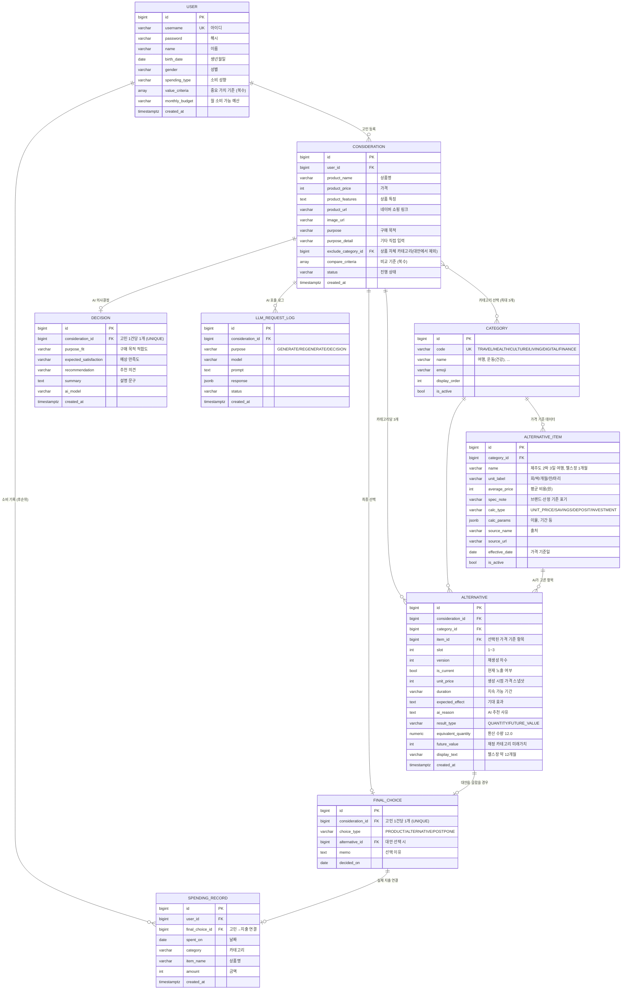

# CHOEZY ERD 설명 문서

> DB: PostgreSQL (PR #2 `feat: PostgreSQL 연동` 기준)

---

## 1. 개요

이 프로젝트는 **"살까 말까 고민하는 상품의 기회비용을 보여주는 서비스"** 이며,
데이터 구조는 **구매 고민 하나를 중심으로** 설계되어 있습니다.

핵심 개념은 다음과 같습니다:

- 하나의 구매 고민 = **Consideration**
- 그 고민에서 생성된 대안들 = **Alternative**
- 대안의 가격 기준 데이터 = **AlternativeItem**

가장 중요한 점 하나:

> **대안의 가격은 AI가 만들지 않고, 우리가 DB에 미리 넣어둔 값을 씁니다.**
> AI는 "어떤 대안을 추천할지"만 고르고, 가격·출처는 `AlternativeItem`에서 가져옵니다.
> 가격까지 AI가 만들면 같은 "일본 여행"이 호출할 때마다 금액이 달라져 기회비용 숫자를 믿을 수 없게 됩니다.

---

## 2. 핵심 구조 (전체 그림)

```
User
└── Consideration (구매 고민 = 상품 + 목적 + 선택 카테고리)
    ├── Alternative (카테고리당 3개 · 기회비용 포함)
    ├── Decision (AI 구매 의사결정)
    └── FinalChoice (최종 선택 결과)

Category (대안 카테고리 6개)
└── AlternativeItem (대안 가격 기준 데이터 · 최대한 많이)
    └── Alternative 가 참조해서 가격을 가져옴
```

핵심은 **Consideration → Alternative → AlternativeItem** 구조

---

## 3. ER 다이어그램



---

## 4. 화면별 데이터 흐름

### 4.1 회원가입

**필요한 데이터**
- 아이디 / 이름 / 생년월일 / 성별 / 비밀번호
- 소비 성향, 중요 가치 기준, 월 소비 가능 예산

**사용하는 테이블**
- `User`

### 4.2 메인페이지 (구매 고민 입력)

**필요한 데이터**
- 구매 고민 중인 상품 (네이버 쇼핑 검색 또는 직접 입력)
- 구매 목적
- 카테고리 선택 (최대 3개)

**사용하는 테이블**
- `Consideration`
- `Category`

### 4.3 대안 생성 페이지

**필요한 데이터**
- 카테고리별 대안 3개
- 대안별 가격·소요 기간
- 개별 재생성 버튼

**사용하는 테이블**
- `AlternativeItem` (AI에게 넘길 후보 목록 + 가격 조회)
- `Alternative` (생성 결과 저장)
- `LLMRequestLog`

### 4.4 비교표 & 기회비용 시각화 페이지

**필요한 데이터**
- 카테고리별 탭
- 선택한 비교 기준에 맞춘 비교표
- 기회비용 환산 결과 (`220만원 = 헬스장 12개월`)

**사용하는 테이블**
- `Alternative`
- `AlternativeItem` (출처·기준일 표시)
- `Consideration` (선택된 비교 기준)

### 4.5 AI 구매 의사결정 페이지

**필요한 데이터**
- 구매 목적 적합도 / 예상 만족도 / 추천 의견
- 설명 문구

**사용하는 테이블**
- `Decision`

### 4.6 최종 선택 결과 입력 페이지

**필요한 데이터**
- 상품 구매 / 대안 선택 / 보류 중 선택
- 선택 이유

**사용하는 테이블**
- `FinalChoice`

### 4.7 소비 기록 (후순위)

**필요한 데이터**
- 날짜 / 카테고리 / 상품명 / 금액
- 월별·카테고리별 소비 차트

**사용하는 테이블**
- `SpendingRecord`

---

## 5. 테이블 설명

### 5.1 User — 소비 프로필

회원가입에서 입력받은 값이 그대로 AI 프롬프트에 들어갑니다.

| 필드 | 설명 |
|---|---|
| `username` | 아이디 (로그인) |
| `name` | 이름 |
| `birth_date` | 생년월일 |
| `gender` | 성별 |
| `spending_type` | 소비 성향 — 경험/만족, 가성비, 성장/자기개발, 자산 형성 |
| `value_criteria` | 중요 가치 기준 (복수) — 가격, 만족도, 품질, 활용도, 장기 가치 |
| `monthly_budget` | 월 소비 가능 예산 — 10만원 이하 ~ 200만원 이상 6구간 |

> 예산을 구간으로 저장하는 이유: 회원가입 UI가 6개 라디오 버튼이고, 비교표의 "가용 예산" 열에서도 이 값을 그대로 씁니다.

### 5.2 Consideration — 구매 고민

**모든 분석의 중심 단위입니다.**

| 필드 | 설명 |
|---|---|
| `user_id` | 누구의 고민인지 |
| `product_name` / `product_price` / `product_features` | 고민 중인 상품 정보 |
| `product_url` / `image_url` | 네이버 쇼핑 API 결과 |
| `purpose` | 구매 목적 — 개발/업무, 디자인/창작, 공부, 취미, 여행 기록, 기타 |
| `purpose_detail` | 기타 선택 시 직접 입력 |
| `exclude_category_id` | 고민 상품이 속한 카테고리. **대안 후보에서 제외**하는 데 씀 |
| `compare_criteria` | 비교 기준 (복수) — 가격, 지속 가능 기간, 기대 효과, 가용 예산 |
| `status` | `DRAFT` → `GENERATED` → `DECIDED` → `CLOSED` |
| (M2M) | 선택한 `Category` 최대 3개 |

> **`exclude_category_id`가 필요한 이유**: "디지털 전자기기" 카테고리 때문입니다. 맥북을 고민하는데 대안으로 "노트북 구매"가 뜨면 의미가 없습니다.

> **상품 정보를 별도 `Product` 테이블로 빼지 않은 이유**: 가격은 조회 시점 스냅샷이어야 하고(나중에 실제 가격이 바뀌어도 계산된 기회비용이 흔들리면 안 됨), 상품 자체를 재사용할 일이 MVP에는 없습니다. 나중에 "이 상품을 고민한 사람들" 같은 기능이 생기면 그때 분리해도 마이그레이션이 간단합니다.

### 5.3 Category — 대안 카테고리 (마스터, 6개)

| code | name |
|---|---|
| `TRAVEL` | 여행 |
| `HEALTH` | 운동(건강) |
| `CULTURE` | 문화(여가) |
| `LIVING` | 생활편의 |
| `DIGITAL` | 디지털 전자기기 |
| `FINANCE` | 재정 |

`is_active`로 노출을 끌 수 있습니다. (재정 카테고리를 MVP에서 뺄 경우 사용)

### 5.4 AlternativeItem — 대안 가격 기준 데이터

| 필드 | 설명 |
|---|---|
| `category_id` | 어떤 카테고리의 항목인지 |
| `name` | `제주도 2박 3일 여행`, `PT 1회`, `서울역-부산역 KTX 왕복` |
| `unit_label` | `회` `박` `개월` `잔` `마리` — 기회비용 문구를 조립할 때 씀 |
| `average_price` | 평균 비용 (원) |
| `spec_note` | `엽떡 기본맛 기준`, `브랜드 명시` 처럼 가격 산정 기준 |
| `calc_type` | 계산 방식 (§7) |
| `calc_params` | 재정 항목의 이율·기간 |
| `source_name` / `source_url` | **출처** |
| `effective_date` | **가격 기준일** |

> **출처와 기준일을 필수로 둔 이유**: "평균 비용"은 시간이 지나면 반드시 틀려집니다. 화면에 *"2026.07 기준 · 출처 OO"* 를 같이 보여줘야 숫자가 신뢰를 얻고, 나중에 값이 틀렸다는 지적을 받아도 방어됩니다.

### 5.5 Alternative — 생성된 대안

AI가 `AlternativeItem` 중에서 고른 결과 + 기회비용 계산 결과입니다.

| 필드 | 설명 |
|---|---|
| `consideration_id` | 어떤 고민에서 나온 대안인지 |
| `category_id` | 어떤 카테고리 탭에 속하는지 |
| `item_id` | AI가 고른 가격 기준 항목 |
| `slot` | 1 / 2 / 3 — 카테고리 안에서의 자리 |
| `version` | 재생성 차수 (최초 1, 재생성할 때마다 +1) |
| `is_current` | 현재 화면에 보이는 행만 `True` |
| `unit_price` | 생성 시점 가격 스냅샷 |
| `duration` | 지속 가능 기간 (비교표 열) |
| `expected_effect` | 기대 효과 (비교표 열) |
| `ai_reason` | 왜 이걸 골랐는지 |
| `equivalent_quantity` / `display_text` | 기회비용 환산 결과 — `헬스장 약 12개월` |

- UNIQUE: `(consideration_id, category_id, slot, version)`

> **`item_id`와 `unit_price`를 둘 다 두는 이유**: FK는 출처·기준일을 항상 최신으로 보여주기 위해, 스냅샷은 이미 계산된 기회비용 숫자가 나중에 흔들리지 않게 하기 위해. 역할이 다릅니다.

> **기회비용을 별도 테이블로 빼지 않은 이유**: 대안 1개당 기회비용 1개로 정확히 1:1이고 항상 같이 계산됩니다. 나누면 조인만 늘어납니다.

**개별 재생성 처리**
```
재생성 버튼 클릭 (여행 카테고리 2번 대안)
  → 기존 행 is_current = False
  → 같은 slot=2, version+1 로 새 행 INSERT (is_current=True)
```
이전 버전을 지우지 않으므로 되돌리기와 재생성 패턴 분석이 가능합니다.

### 5.6 Decision — AI 구매 의사결정

점수 대신 **높음 / 중간 / 낮음** 3단계로 저장합니다.

| 필드 | 설명 |
|---|---|
| `purpose_fit` | 구매 목적 적합도 — HIGH / MIDDLE / LOW |
| `expected_satisfaction` | 예상 만족도 — HIGH / MIDDLE / LOW |
| `recommendation` | 추천 의견 — HIGH / MIDDLE / LOW |
| `summary` | *"현재 사용자는 업무 생산성을 중요하게 생각하고 있으며…"* |

- `consideration_id`에 UNIQUE (고민 1개당 결론 1개)

### 5.7 FinalChoice — 최종 선택 결과

| 필드 | 설명 |
|---|---|
| `choice_type` | `PRODUCT` 그대로 구매 / `ALTERNATIVE` 대안 선택 / `POSTPONE` 보류 |
| `alternative_id` | 대안을 골랐을 때만 채움 |
| `memo` | 선택 이유 |
| `decided_on` | 선택 날짜 |

> 이 테이블이 **후순위 기능(과거 데이터 장기 분석, AI 소비 습관 조언)의 재료**가 됩니다. "AI가 보류를 권했는데 구매한 비율" 같은 개인화 지표가 여기서 나옵니다.

### 5.8 LLMRequestLog — AI 호출 로그

Gemini 응답 파싱은 자주 실패합니다. 프롬프트를 고칠 때와 버그를 재현할 때 필요하므로 MVP에 포함하기를 권합니다.
`purpose`로 최초 생성 / 개별 재생성 / 의사결정 호출을 구분합니다.

### 5.9 SpendingRecord — 소비 기록 (후순위)

날짜 · 카테고리 · 상품명 · 금액. `final_choice_id`로 "고민 → 실제 지출"을 연결하면 개인화 분석의 재료가 됩니다.

- INDEX: `(user_id, spent_on)` — 월별 집계용
- 월별 집계 테이블은 두지 않습니다. 인덱스만 있으면 `TruncMonth` + `Sum`으로 충분합니다.

---

## 6. 카테고리 규칙

| 규칙 | 반영 위치 |
|---|---|
| 카테고리 6개 | `Category` 마스터 6행 |
| **카테고리별 대안은 최대한 많이** | `AlternativeItem` 행을 많이 쌓음 (후보 풀) |
| 대안 생성은 카테고리별 3개 | `Alternative.slot` 1~3 |
| 대안 하나씩 개별 재생성 | `Alternative.version` + `is_current` |
| 카테고리 최대 3개 선택 | `Consideration` ↔ `Category` M2M, 서비스 레이어에서 검증 |

> **"최대한 많이"와 "3개"는 서로 다른 테이블 이야기입니다.**
> `AlternativeItem`(후보 풀)은 많을수록 좋습니다 — 개별 재생성을 눌렀을 때 새로운 대안이 나오려면 풀이 넉넉해야 합니다. 풀이 5개뿐이면 재생성을 두세 번만 눌러도 보여줄 게 없어집니다.
> `Alternative`(화면에 보이는 것)는 카테고리당 3개입니다.
> **이 둘을 한 테이블로 합치면 "최대한 많이"와 "3개"가 충돌합니다.** 테이블을 나눈 핵심 이유입니다.

**카테고리 최대 3개 제약**은 DB CHECK로 표현할 수 없습니다. `alternatives/services.py`(이미 있는 파일)에서 검증하고, 상수는 `settings.MAX_CATEGORY_SELECTION = 3`으로 둡니다.

---

## 7. 기회비용 계산 — 두 갈래

### 소비형 (`calc_type = UNIT_PRICE`) — 카테고리 1~5

```
equivalent_quantity = 상품 가격 ÷ item.average_price
display_text        = "{item.name} 약 {수량}{unit_label}"
```
예) 220만원 ÷ 18만원(헬스장 1개월) = **헬스장 약 12개월**

### 재정형 (`calc_type = SAVINGS / DEPOSIT / INVESTMENT`) — 카테고리 6

**나눗셈이 성립하지 않습니다.** `정기적금(30만원 3%)`은 "220만원으로 적금을 몇 개 든다"가 아니라 **"220만원을 넣으면 얼마가 되는가"** 입니다.

```
future_value = 원금 + 이자(수익)
display_text = "{item.name} 12개월 → 약 226만원"
```

| calc_type | 예시 | `calc_params` |
|---|---|---|
| `SAVINGS` | 정기적금 (30만원 3%) | `{"monthly_amount": 300000, "annual_rate": 0.03, "term_months": 12}` |
| `DEPOSIT` | 예금 (100만원 3%) | `{"principal": 1000000, "annual_rate": 0.03, "term_months": 12}` |
| `INVESTMENT` | ETF 투자 | `{"ticker": "379800", "base_date": "2026-07-28"}` |

> **ETF 주의.** 기획 메모가 *"우리가 하는 날짜 기준"* 이라 특정 기준일 수익률을 씁니다. 실시간 시세 API는 MVP 범위를 넘으므로 **기준일 수익률을 고정값으로 시딩**하고 화면에 기준일을 명시하는 방식을 권합니다.
> 재정 카테고리는 구현 비용이 가장 큽니다. **일정이 빠듯하면 `FINANCE`만 `is_active=False`로 내리고 5개로 출시**해도 나머지 설계는 그대로 동작합니다.

---

## 8. 중요한 포인트

### 1. 테이블로 둘지 choices로 둘지의 기준

- **테이블** — 항목이 계속 늘어나고 가격·출처 같은 부가 데이터가 붙는 것 → `Category`, `AlternativeItem`
- **choices** — 값이 고정된 소수이고 부가 데이터가 없는 것 → 소비 성향, 중요 가치 기준, 비교 기준, 구매 목적

중요 가치 기준(5개)과 비교 기준(4개)을 마스터 테이블로 빼지 않은 이유입니다. 이 값들은 조인해서 집계할 일이 없고, 선택지가 바뀌면 어차피 화면도 고쳐야 하므로 테이블로 둬도 이득이 없습니다.

### 2. AI에게 넘길 때 후보를 미리 좁힙니다

```
선택된 카테고리의 AlternativeItem 목록 (고민 상품 카테고리는 제외)
  → 프롬프트에 넣고 "이 중에서 3개를 골라라"
  → 없는 항목을 지어내는 문제가 사라지고, 가격은 항상 DB에서 조회
```

### 3. 스냅샷을 남기는 곳

`Alternative.unit_price` 한 곳. 마스터 가격을 갱신해도 과거에 계산된 기회비용이 바뀌지 않습니다.

### 4. 필드 변경 가능성

구조는 안정적이고, 늘어날 가능성이 있는 건 `AlternativeItem`의 **행 수**입니다. 필드가 아니라 데이터가 늘어납니다.

---

## 9. 한 줄 요약

> **"구매 고민 하나를 기준으로, DB에 쌓아둔 대안 가격 데이터를 붙여 기회비용을 보여주는 구조"**

---

## 10. 구현 순서

**1단계 — 반드시 먼저**
- `AUTH_USER_MODEL = "accounts.User"` 선언 **후** 첫 `makemigrations`
  (마이그레이션을 한 번 돌린 뒤에는 커스텀 유저 교체가 사실상 불가능해 DB를 다시 만들어야 합니다. PR #2 머지 직후 최우선 작업)

**2단계 — 시드 데이터**
- `Category` 6건, `AlternativeItem` 최대한 많이 → data migration(`RunPython`)으로
- 팀원 로컬 DB가 전부 같아야 기회비용 숫자가 일치하므로 fixture보다 migration이 안전합니다

**3단계 — 핵심 플로우**
- `Consideration` → `Alternative` → `Decision` → `FinalChoice`

**4단계 — 후순위**
- `SpendingRecord`, AI 소비 습관 조언

### 앱 배치

| 앱 | 테이블 |
|---|---|
| `core` | (추상) `TimeStampedModel` |
| `accounts` | `User` |
| `products` | `Consideration` |
| `alternatives` | `Category`, `AlternativeItem`, `Alternative`, `LLMRequestLog` |
| `analyses` | `Decision`, `FinalChoice`, `SpendingRecord` |

### 기타 규칙

- 금액은 `PositiveIntegerField` (원 단위 정수, 약 21억까지) / `equivalent_quantity`만 `DecimalField(8,2)`
- `on_delete` — 사용자 데이터(`Consideration`, `Alternative`)는 `CASCADE`, 마스터 참조(`Category`, `AlternativeItem`)는 `PROTECT`
- 공통 `TimeStampedModel`(`created_at`, `updated_at`)은 `core/models.py`에 abstract로 정의 후 상속

---

## 11. 확인이 필요한 항목

- **비회원 체험 플로우** — 지원한다면 `Consideration.user`를 nullable로 바꾸고 `session_key` 컬럼 추가 필요

---

## 12. 보류 — 상품 A/B 비교

기존 기획의 "추가기능 1"이지만 최신 핵심 플로우의 필수·후순위 목록에 없어 MVP에서 제외합니다. 되살릴 경우:

- `ProductComparison`: `user`, `consideration_a`, `consideration_b`, `ai_summary`
  → 상품이 아니라 **고민 2건**을 참조하면 대안 생성·기회비용 계산 로직을 그대로 재사용할 수 있습니다.
